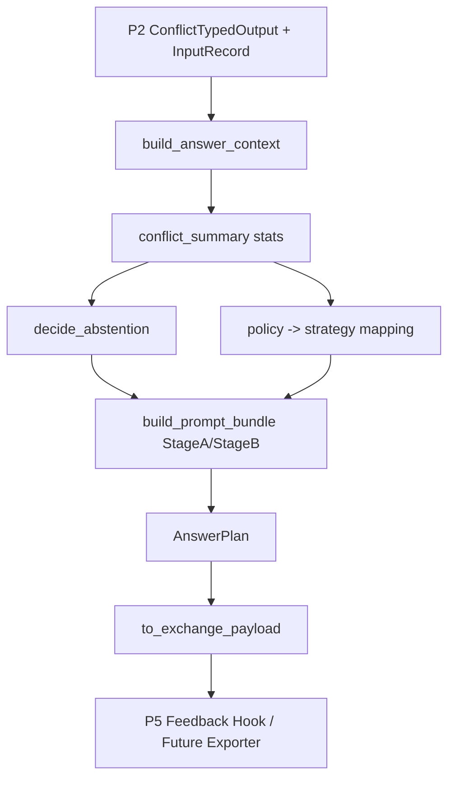

# P6 技术设计文档（P6-facing Prompt Strategy）

## 1. 设计目标与原则

1. **单一上游输入**：只消费 P2 `ConflictTypedOutput`，不重复冲突分类逻辑。  
2. **接口稳定**：保持对 P2 既有 API 的兼容，迁移后不影响已有调用。  
3. **可解释性优先**：输出必须携带冲突摘要、证据来源、claim 级可追溯信息。  
4. **强约束生成**：固定结构化输出字段，降低互斥 claim 错误融合与幻觉。  
5. **可扩展性**：预留 P5 指标迭代与未来模块标准化对接通道。  

---

## 2. 模块结构

### 2.1 `contracts.py`

定义核心数据结构：

- `EvidenceItem`
- `ConflictSummary`
- `AnswerContext`
- `PromptBundle`
- `AbstentionDecision`
- `AnswerPlan`

### 2.2 `planner.py`

实现核心编排算法：

- `build_answer_context`
- `decide_abstention`
- `build_prompt_bundle`
- `build_answer_plan_for_sample`
- `build_answer_plans`

### 2.3 `extensions.py`

面向 P5 / 未来模块的标准扩展接口：

- `QueryEnvelope`
- `EvidenceCluster`
- `AnswerPlanExchange`
- `P5FeedbackHook` (Protocol)
- `DownstreamExporter` (Protocol)
- `to_exchange_payload`

---

## 3. 核心算法说明

## 3.1 AnswerContext 聚合算法

输入：单条 `TypedSample` + 对应 `InputRecord`  
流程：

1. 提取 query（优先 `role=query` claim）
2. 遍历 `pair_results` 聚合统计：
   - `policy_distribution`
   - `contradiction_ratio`
   - `low_confidence_ratio`
   - `average_typing_confidence`
3. 抽取 `claim_a_id/claim_b_id` 对应 claim，去重后构造 `EvidenceItem`
4. 按 stance 聚类到 `support/oppose/neutral`
5. 构建 citations（`source_url/source_medium/time`）与 `trace_claim_ids`

## 3.2 策略映射算法

映射规则（以 P2 `resolution_policy` 为准）：

- `prefer_latest` -> `temporal_prefer_latest`
- `show_all_sides` -> `parallel_opinions`
- `disambiguate_first` -> `disambiguate_then_answer`
- `abstain` -> `abstain_with_explanation`
- `down_weight_low_quality` -> `quality_weighted_answer`
- `skip` -> `drop_noise`
- `pass_through` -> `balanced_summary`

门控触发后强制 `abstain_with_explanation`。

## 3.3 拒答门控算法

阈值：

- `contradiction_ratio >= 0.5`
- `low_confidence_ratio >= 0.6` 且 `average_typing_confidence <= 0.5`
- 或 `primary_resolution_policy == "abstain"`

输出：

- `should_abstain` 布尔值
- `reason` 可解释原因
- `threshold_snapshot` 当前阈值快照

## 3.4 两阶段提示生成

Stage A（分析草案）：

- 只做冲突分析、分歧点与证据缺口归纳
- 禁止下最终结论

Stage B（最终输出）：

- 注入策略指令与拒答门控结果
- 强制 JSON 结构输出字段：
  - `结论`
  - `分歧点`
  - `证据列表`
  - `置信度`
  - `是否拒答`

---

## 4. 数据结构定义（关键字段）

## 4.1 `AnswerContext`

- `sample_id`: 样本 ID
- `query`: 问题文本
- `evidence_clusters`: `{support|oppose|neutral: EvidenceItem[]}`
- `conflict_summary`: 冲突统计摘要
- `citations`: 来源信息数组
- `trace_claim_ids`: 可追溯 claim_id 列表

## 4.2 `PromptBundle`

- `strategy_name`: 当前策略名
- `stage_a_analysis_prompt`: 阶段A提示词
- `stage_b_answer_prompt`: 阶段B提示词
- `output_schema`: 强约束输出 schema

## 4.3 `AnswerPlanExchange`（扩展交互载体）

- `version`: 交换协议版本（如 `p6.v1`）
- `query`: 统一 QueryEnvelope
- `clusters`: 标准化 EvidenceCluster 列表
- `plan`: 完整 `AnswerPlan.to_dict()`
- `debug`: 扩展诊断信息

---

## 5. 运行逻辑流程图

---

## 6. 与 P2 的兼容性方案

1. P6 独立放在项目根目录 `P6/`。  
2. P2 保留原公开函数名与导出项。  
3. P2 通过兼容层转发调用到 `P6/src/p6`。  
4. 现有 P2 测试脚本无需修改调用方式即可运行。  

---

## 7. 面向 P5/未来模块的扩展预留

- 标准化交换协议：`AnswerPlanExchange(versioned)`
- 扩展点协议：`P5FeedbackHook`, `DownstreamExporter`
- 非侵入集成：不改变 P2 基础契约，仅新增并行输出通道
- 版本演进策略：新增字段采用向后兼容方式扩展，不重命名核心键

